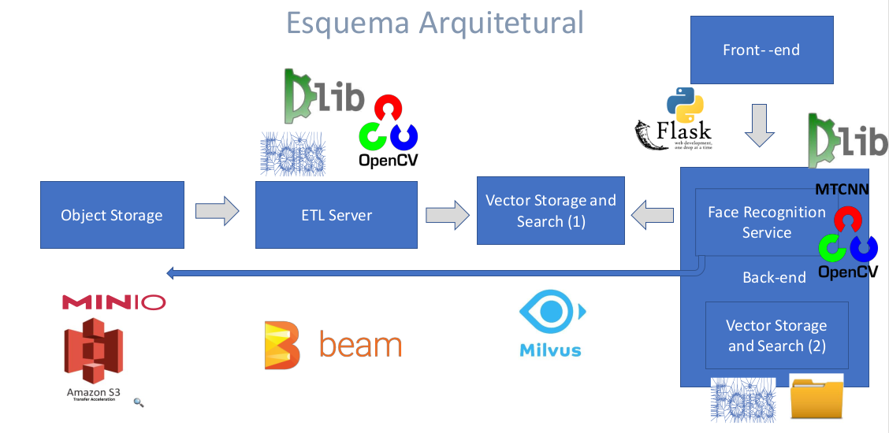

# Face Recognition Lab

Proof of concept of techonologies related to face recognition problem.

## Architecture 

## Application 

To start the application, execute the follow command:

``docker-compose up -d --build``

# References

* Used Data set http://mmlab.ie.cuhk.edu.hk/projects/CelebA.html
* https://medium.com/trainingcenter/flask-restplus-ea942ec30555
* https://blog.onebar.io/building-a-semantic-search-engine-using-open-source-components-e15af5ed7885
* https://medium.com/gsi-technology/integrating-textual-and-visual-information-into-a-powerful-visual-search-engine-c477486a18ff
* https://milvus.io/
* https://gnes.ai/
* https://github.com/nmslib/nmslib
* https://aws.amazon.com/pt/about-aws/whats-new/2020/03/build-k-nearest-neighbor-similarity-search-engine-with-amazon-elasticsearch-service/?nc1=h_ls
* https://github.com/erikbern/ann-benchmarks
* https://github.com/erikbern/ann-benchmarks
* https://medium.com/@Intellica.AI/a-guide-for-building-your-own-face-detection-recognition-system-910560fe3eb7
* https://docs.opencv.org/3.4/db/d28/tutorial_cascade_classifier.html
* https://medium.com/brasil-ai/mapeamento-facial-landmarks-com-dlib-python-3a200bb35b87
* https://www.cv-foundation.org/openaccess/content_cvpr_2015/app/1A_089.pdf

